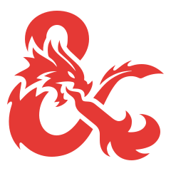

# CF | Ded Base

**Initial commit**: 16/08/24

**Stack**: Odoo, Owl, Python, JS, XML, HTML, CSS, SCSS e Bootstrap.

**Descrizione**: In questo modulo vengono introdotti i modelli base per *Dungeon & Dragons*:

- Biomi
- Creature
- Scontri
- Fazioni
- NPC
- Incontri
- Strutture

