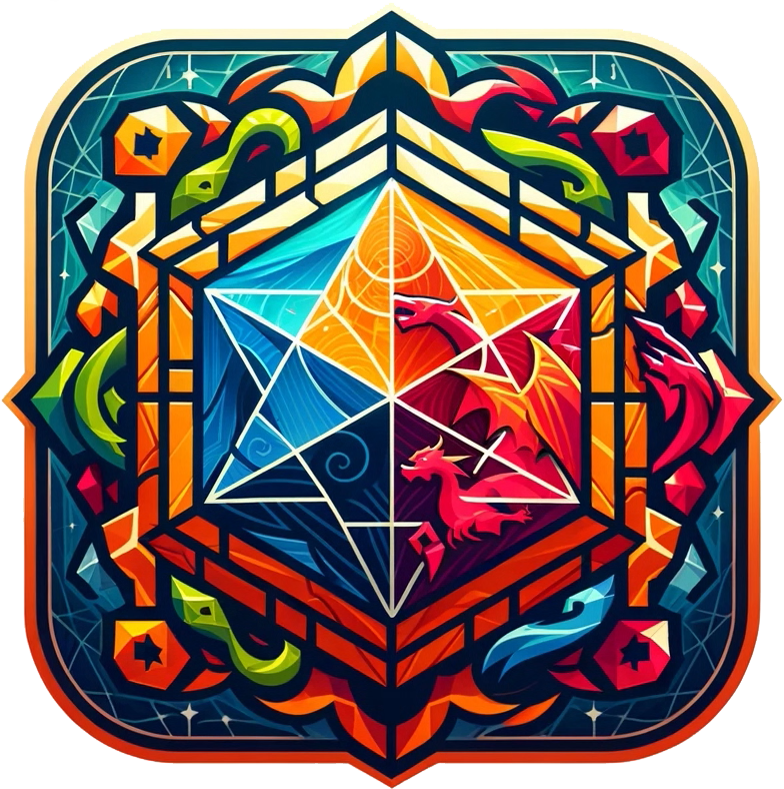

# CF | Hex Ded Client

📅 **Initial commit**: 21/01/24  
🛠 **Stack**: Odoo, Owl, Python, JS, XML, HTML, CSS, SCSS e Bootstrap

## Descrizione

In questo modulo viene introdotto:

- Un'interfaccia per poter interagire direttamente con le mappe in modo più semplice.
- Il widget "QuadWidget" per visualizzare la mappa dei quadranti nei relativi Form.
- Il modello "asset_tile" che permette assegnare un immagine(Montagne/Alberi/Incroci/...) a uno specifico Hex.
